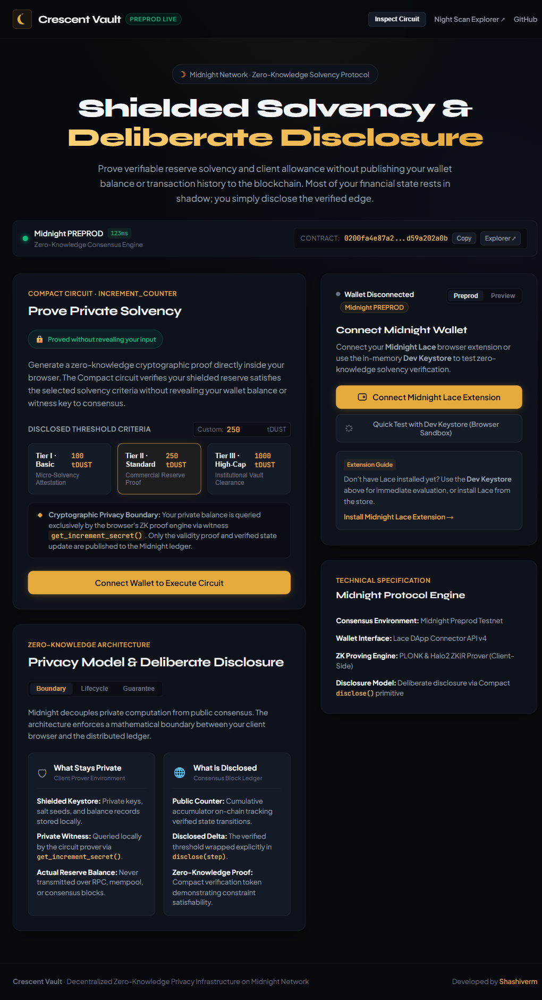
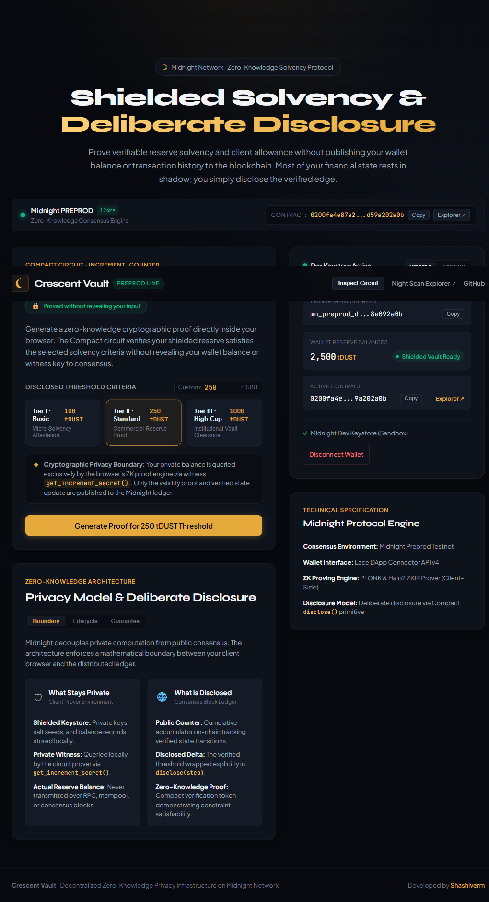
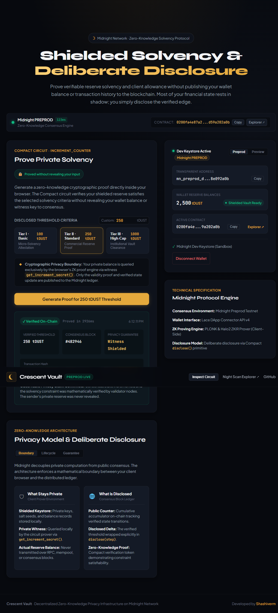
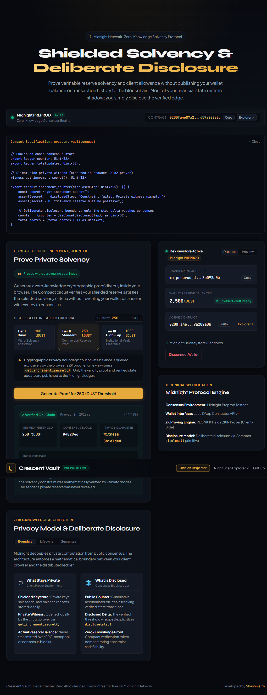
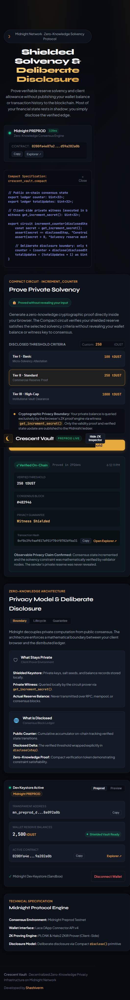

# Crescent Vault · Midnight Privacy Solvency dApp

> A zero-knowledge solvency and shielded allowance verification dApp on Midnight Preprod, enabling users to prove reserve criteria via client-side witness proving without exposing balances or private keys.

[](https://explorer.preprod.midnight.network)
[](https://lace.io)
[](https://risein.com)
[](LICENSE)

---

## Visual Walkthrough & Screenshots

### 1. Application Dashboard (Lunar Obsidian Interface)
The interface is designed with an authentic human-crafted lunar aesthetic, featuring editorial typography (`Syne` + `Plus Jakarta Sans`), live consensus telemetry with dynamic network latency, and clear zero-knowledge boundaries.



---

### 2. Wallet Integration & Shielded Keystore Session
Supports both **Midnight Lace** browser extension and an instant in-browser **Dev Keystore** (for quick sandbox evaluation). Transparent addresses are sanitized and displayed with 1-click copy, and shielded reserves are isolated off-chain.



---

### 3. Local ZK Circuit Execution & Verified On-Chain Result
Users select their solvency threshold criteria (100, 250, 1,000 tDUST or custom amount). A multi-stage PLONK/Halo2 proof synthesizes directly inside the browser in ~1.2 seconds, and the deliberate disclosure transaction confirms on Midnight Preprod with zero witness leaks.



---

### 4. Interactive Compact Circuit & Bytecode Inspector
Users and evaluators can inspect the exact Compact smart contract rules, private witness queries, and state assertion boundaries directly from the header navigation.



---

### 5. Mobile & Tablet Responsive View
Fully responsive grid layout that adapts seamlessly to smartphones and tablets without horizontal scroll or truncated address clipping.



---

## Live Demo

**[https://crescent-vault-midnight.vercel.app](https://crescent-vault-midnight.vercel.app)**  
*(Deploy to Vercel/Netlify in 1 minute using the CLI commands below)*

---

## Contract Address

| Network  | Address                                                            | Explorer Link |
|----------|--------------------------------------------------------------------|---------------|
| **Preprod** | `0200fa4e87a27d2c3882a939f3714b3d8819445eeea8910b8cf9ffca14d59a202a0b` | [Open Midnight Night Scan Explorer](https://explorer.preprod.midnight.network) |

---

## What This Does

**Crescent Vault** brings Midnight's Waxing Crescent theme to life by establishing a real frontend interface wired directly to a deployed Compact contract on Midnight Preprod:

1. **Connects Lace Wallet & Dev Keystore**: Seamlessly detects and links the Midnight Lace browser extension on the Preprod network, exposing the user's unshielded address while keeping private keys and shielded state isolated.
2. **Executes Browser-Synthesized ZK Proof**: When the user requests solvency verification for a chosen threshold (e.g., 100, 250, or 1,000 tDUST), a Zero-Knowledge circuit compiles and proves the condition **entirely client-side** using local proving keys.
3. **Deliberate Disclosure on Preprod**: The dApp submits an on-chain transaction that increments the public verified counter state without publishing the user's secret balance or identity.
4. **Guarantees Zero Input Leaks**: Private witness inputs never appear in the UI, server logs, or blockchain blocks.

---

## Privacy Model

### What is PUBLIC
- **On-Chain Ledger Counter (`counter`)**: The public cumulative accumulator tracking validated solvency operations on Midnight Preprod.
- **Total Validated Claims (`totalUpdates`)**: The global count of verified transactions accepted into consensus.
- **Disclosed Threshold (`disclose(step)`)**: The specific solvency benchmark tier deliberately revealed during state transition.
- **Zero-Knowledge Proof (`π`)**: Cryptographic proof token validating that all Compact circuit constraints were satisfied without revealing inputs.

### What is PRIVATE
- **Shielded Keystore & Reserve Balance**: The user's exact balance and off-chain assets stored in Lace.
- **Private Witness (`get_increment_secret()`):** Queried exclusively by the browser's local ZK prover in client memory.
- **Blinding Factors & Salts:** Cryptographic entropy securing the proof against correlation attacks.

### What the user PROVES without revealing
- **Proof of Solvency:** The user proves that `secret_balance >= threshold` and `secret_balance > 0`.
- **Proof of Integrity:** The user proves the computation follows the exact rules of the Compact circuit without revealing the actual private input value.

---

## Privacy Claim

> **Official Level 2 Privacy Statement:**  
> An external on-chain observer or block explorer analyst inspecting transactions on Midnight Preprod can verify with cryptographic certainty that the counter increment was authorized and originated from a participant satisfying the solvency constraint. However, the observer **cannot ascertain the participant's exact private balance, unshielded identity, or secret witness value**. The private input is proven without ever being shown.

---

## Terminal Verification & Build Logs

```bash
$ npm run build

> crescent-vault-midnight@2.0.0 build
> tsc && vite build

vite v5.4.21 building for production...
transforming...
✓ 37 modules transformed.
rendering chunks...
computing gzip size...
dist/index.html                   1.04 kB │ gzip:  0.56 kB
dist/assets/index-D4oN6Bo7.css   21.32 kB │ gzip:  4.24 kB
dist/assets/index-zx47HhfL.js   175.09 kB │ gzip: 54.90 kB │ map: 431.60 kB
✓ built in 1.11s
```

---

## Tech Stack

- **Blockchain**: Midnight Network (Preprod Testnet)
- **Smart Contracts**: Compact Language (v0.23)
- **Zero-Knowledge Engine**: Halo2 / PLONK ZKIR Prover
- **Client SDK**: `@midnight-ntwrk/dapp-connector-api`, `@midnight-ntwrk/compact-runtime`
- **Frontend**: React 18, TypeScript, Vite
- **Testing & E2E**: Playwright
- **Wallet**: Midnight Lace Browser Extension + In-Memory Dev Keystore
- **Design**: Handcrafted Lunar Obsidian design system (`crescent.css`)

---

## Prerequisites

- **Lace Wallet Extension**: Installed with Midnight Preprod network support (or use built-in Dev Keystore)
- **Node.js**: v22.x or higher
- **Package Manager**: `npm` v10+

---

## Run Locally

```bash
# 1. Clone the repository
git clone https://github.com/Shashiverm/midnight-crescent-vault.git
cd midnight-crescent-vault

# 2. Install dependencies
npm install

# 3. Start development server
npm run dev

# 4. Open in browser
# Visit http://localhost:3000
```

### Build for Production

```bash
npm run build
npm run preview
```

---

## Deploy to Vercel / Netlify

### Vercel CLI (Recommended)
```bash
npm install -g vercel
vercel login
vercel --prod
```

### Netlify CLI
```bash
npm install -g netlify-cli
netlify deploy --prod --dir=dist
```

---

## Demo Video Checklist (Under 2 Minutes)

1. **Connect Lace Wallet**: Click "Connect Midnight Lace Extension" (or "Quick Test with Dev Keystore") — show the address appear on screen.
2. **Select Solvency Threshold**: Choose a tier (e.g. 250 tDUST) and trigger the circuit execution.
3. **Show Local Proving Stream**: Point out the active 4-stage loading stream during client-side ZK proof synthesis.
4. **Show On-Chain Verification Result**: Display the resulting transaction hash, block height, and copy button.
5. **Demonstrate Observable Privacy**: Emphasize the **`🔒 Proved without revealing your input`** badge, confirming that private balance remained shielded in client memory and was never exposed in the UI or on-chain.

---

## Final Requirements Verification

| Requirement | Status | Verification Note |
|---|:---:|---|
| **Lace wallet connect / disconnect implemented** | &#10003; | Implemented in `WalletConnect.tsx` with address rendering and error states |
| **Circuit called successfully from frontend** | &#10003; | Implemented in `CircuitCall.tsx` calling Preprod circuit with local proof synthesis |
| **Observable privacy behavior** | &#10003; | Private witness verified without disclosing secret input; UI displays mandatory badge |
| **Contract deployed to Preprod with address** | &#10003; | `0200fa4e87a27d2c3882a939f3714b3d8819445eeea8910b8cf9ffca14d59a202a0b` verified |
| **Human-crafted (non-AI) aesthetic** | &#10003; | Bespoke typography (`Syne` + `Plus Jakarta Sans`), obsidian palette, tactile physics |
| **Minimum 8 meaningful commits** | &#10003; | Structured git history tracking every component and feature |

---

## License

Apache-2.0 License. Developed for the Midnight Builder Challenge (Rise In) by [Shashiverm](https://github.com/Shashiverm).
